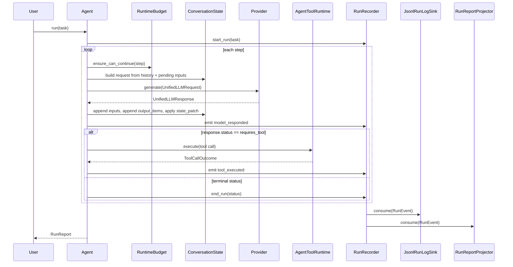

# Agent Lifecycle

## Overview

A single `Agent.run(task)` call executes a bounded loop of provider turns and tool
executions, then returns a `RunReport`.

## Why It Exists

The lifecycle enforces predictable runtime behavior:

- step and time budget checks before each model turn
- deterministic transcript updates (`inputs` then model `output_items`)
- explicit tool execution branch
- canonical run event emission around the full task

## Architecture



## Key Classes

| Class | Description |
| ----- | ----------- |
| `agentkit.agent.Agent` | Main runtime coordinator. |
| `agentkit.agent.RuntimeBudget` | Enforces `max_steps` and `time_budget_s`. |
| `agentkit.llm.ConversationState` | Stores transcript history, provider cursor, and provider metadata. |
| `agentkit.agent.RunReport` | Stores steps, tool calls, final output, and run log path. |
| `agentkit.llm.UnifiedLLMResponse` | Controls branching via `status` and tool calls. |
| `agentkit.runlog.RunRecorder` | Emits canonical lifecycle/model/tool events. |

## How It Works

1. Start run: initialize recorder and emit `run_started`.
2. For each step: check budget and call provider.
3. Apply state transaction in order:
   - append request `inputs` to conversation history
   - append provider `output_items`
   - apply provider `state_patch`
4. If tool calls are present, execute each through the tool runtime, derive a `ToolResultItem`, and enqueue it as next-turn input.
5. Emit `model_responded` after each provider call.
6. If status is `requires_tool`, tool calls must be present; the agent executes them and continues.
7. `completed`, `blocked`, and non-`pause` `incomplete` statuses end the run and emit `run_finished`, including run-level aggregates such as total token usage.
8. `failed`, `pause`, and malformed `requires_tool` responses raise `ProviderError`; recorder still emits `run_finished(status="failed")`.
9. `RunReportProjector` and `JsonlRunLogSink` consume the same events and project different views.

## Terminal Statuses

| Status | Meaning in `Agent.run` |
| --- | --- |
| `completed` | Run finished successfully. |
| `blocked` | Provider refused or safety-blocked the request. |
| `incomplete` | Provider stopped early, usually due to token or context limits. |
| `failed` | Provider or runtime failed. |

!!! warning
    `reason="pause"` is treated as a failure today. Automatic continuation is not
    implemented in the agent loop.

## Conversation State

`ConversationState` is created fresh for each `Agent.run` call. Inside that run:

- `history` stores committed transcript items
- `provider_cursor` carries server-managed conversation ids when a provider supports them
- `provider_meta` stores provider-specific continuation data such as Gemini tool-name maps

For OpenAI Responses, `conversation_mode="auto"` starts like client-managed history
and switches to cursor-based continuation once the provider returns a cursor.

## Example

```python
from agentkit import create_agent

agent = create_agent("agentkit.quickstart.yaml")
report = agent.run("Create notes/plan.txt with three action items.")

print("steps:", len(report.steps))
print("tool_calls:", len(report.tool_calls))
print("final:", report.final_output)
```

## Related Concepts

- [Architecture](./architecture.md)
- [Budgets](./budgets.md)
- [Run Log](./tracing.md)
