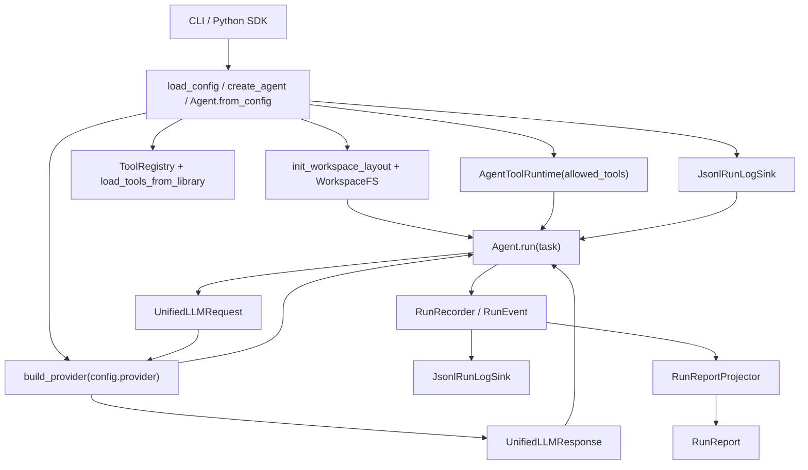

# Architecture

## Overview

AgentKit is organized around one runtime loop, `Agent.run(task)`, and a small set
of supporting modules:

- `config` builds validated runtime settings
- `workspace` enforces file isolation
- `llm` provides provider-agnostic request/response types
- `tools` exposes executable capabilities to the model
- `runlog` defines canonical runtime facts and projections
- `cli` turns config + task input into one agent run

## Why It Exists

The design isolates provider-specific logic from agent orchestration. That keeps
provider adapters, tools, workspace access, and run logging replaceable without
changing the core control flow.

## Architecture



## Key Classes

| Class | Description |
| ----- | ----------- |
| `agentkit.agent.Agent` | Orchestrates model calls, tool execution, and event emission. |
| `agentkit.config.AgentkitConfig` | Top-level runtime configuration object. |
| `agentkit.llm.UnifiedLLMRequest` | Provider-agnostic model input contract. |
| `agentkit.llm.UnifiedLLMResponse` | Provider-agnostic model output contract. |
| `agentkit.tools.ToolRegistry` | Registers and executes validated tools. |
| `agentkit.agent.AgentToolRuntime` | Filters tools by allowlist and builds `ToolResultItem` values. |
| `agentkit.workspace.WorkspaceFS` | Workspace-scoped filesystem facade. |
| `agentkit.runlog.RunRecorder` | Canonical event emitter for one run. |
| `agentkit.runlog.JsonlRunLogSink` | JSONL run log sink with redaction/truncation. |
| `agentkit.agent.RunReportProjector` | Projects the canonical event stream into a final `RunReport`. |

## Module Inventory

These are the current top-level modules under `src/agentkit/`:

| Module | Responsibility |
| --- | --- |
| `agentkit` | Top-level convenience exports such as `create_agent` |
| `agent` | Runtime loop, budgets, reports, tool runtime |
| `cli` | `agentkit` command parser and dispatch |
| `config` | Schema, loader, provider defaults |
| `constants` | Shared default values |
| `errors` | Framework exceptions and provider issue metadata |
| `llm` | Unified types, usage helpers, provider factory, provider adapters |
| `runlog` | Canonical run events, recorder, sinks, JSONL output |
| `tools` | Tool base classes, types, loader, registry, built-in library |
| `workspace` | Path isolation and workspace layout helpers |

## How It Works

1. Config is loaded and validated into dataclasses.
2. `Agent.from_config` creates the workspace root, provider, tool registry, tool runtime, and JSONL sink.
3. The built-in tool library is always loaded into the registry, then filtered by `tools.allowed`.
4. `Agent.run` creates a `RunRecorder` with two sinks: `RunReportProjector` and `JsonlRunLogSink`.
5. Each iteration builds a `UnifiedLLMRequest` from the current `ConversationState` plus pending inputs.
6. The provider returns a `UnifiedLLMResponse` containing assistant text, reasoning items, and optional tool calls.
7. Tool calls are executed through `AgentToolRuntime`, converted into `ToolResultItem` values, and sent into the next model turn.
8. Terminal statuses end the run and emit `run_finished`; failures still emit a terminal event before the exception is re-raised.

## Architectural Notes

!!! note
    `Agent.from_config` always loads the modules under `agentkit.tools.library`,
    but the model only sees tools that appear in `config.tools.allowed`.

!!! note
    The current codebase has no public `context` package. Earlier documentation
    references to `context` are no longer accurate.

## Example

```python
from agentkit import create_agent

agent = create_agent("agentkit.quickstart.yaml")
report = agent.run("List files in the workspace and summarize them.")

print(report.completed)
print(report.final_output)
print(report.runlog_path)
```

## Related Concepts

- [Agent Lifecycle](./agent-lifecycle.md)
- [LLM Providers](./llm-providers.md)
- [Tools System](./tools-system.md)
- [Run Log](./tracing.md)
