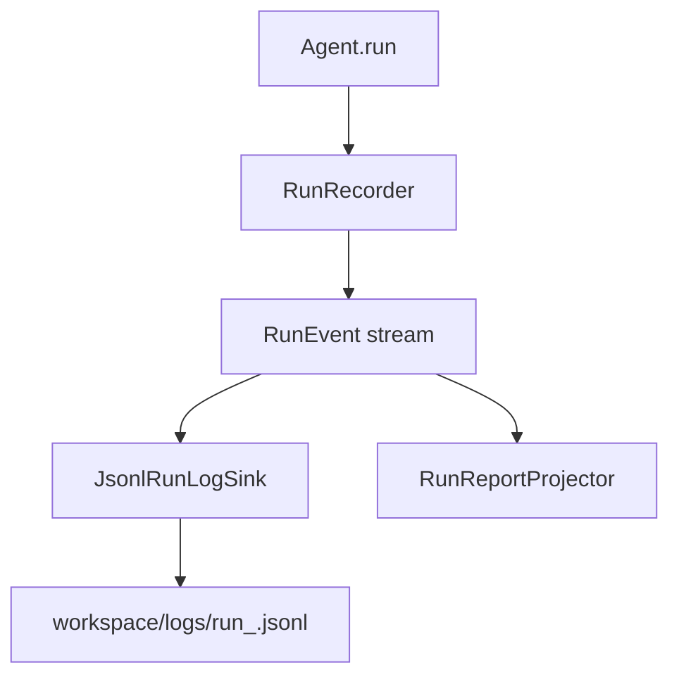

# Run Log

## Overview

AgentKit writes JSONL run logs from canonical `RunEvent` objects. The event stream
is the source of truth; both the JSONL file and the in-memory `RunReport` are
projections of that stream.

## Why It Exists

Run logs give reproducible runtime visibility without coupling observability to any external vendor.

## Architecture



## Key Classes

| Class | Description |
| ----- | ----------- |
| `agentkit.runlog.RunRecorder` | Run-scoped canonical event emitter. |
| `agentkit.runlog.RunEvent` | Normalized runtime event envelope. |
| `agentkit.runlog.JsonlRunLogSink` | JSONL sink with redaction/truncation. |
| `agentkit.agent.RunReportProjector` | In-memory event projector used by `Agent.run`. |

## How It Works

1. `RunRecorder.start_run` creates a run id and emits `run_started` with run-scoped static context.
2. Each later runtime fact is emitted as one `RunEvent` (`model_responded`, `tool_executed`, `run_finished`).
3. `tool_executed` records both the raw tool `output` and the model-facing `model_payload`.
4. `run_finished` can include run-level aggregates such as total token usage across all model turns.
5. `JsonlRunLogSink.consume` writes each event as one JSON line.
6. Optional sanitization redacts sensitive key names and truncates oversized strings.

## Event Model

Current event kinds:

- `run_started`
- `model_responded`
- `tool_executed`
- `run_finished`

The current schema identifier is `agentkit.run_event.v3`.

`model_payload` is the exact payload that the next model turn sees for that tool result. It may be a compact dictionary or a plain text string such as a numbered file snippet. Logging it alongside `output` makes it possible to debug transcript state without losing the richer raw tool result.

## Example

```python
from agentkit.config.schema import RunLogConfig
from agentkit.runlog import JsonlRunLogSink, RunRecorder
from agentkit.workspace.fs import WorkspaceFS

fs = WorkspaceFS("./workspace")
runlog_sink = JsonlRunLogSink(fs, RunLogConfig(enabled=True, redact=True, max_text_chars=1000))
recorder = RunRecorder([runlog_sink], run_id_factory=lambda: "demo_run")

run_id = recorder.start_run(
    task="demo",
    context={"provider": "openai", "model": "gpt-5-mini", "tools": []},
)
recorder.emit(
    "tool_executed",
    step=0,
    payload={
        "call_id": "call-1",
        "name": "word_count",
        "is_error": False,
        "arguments": {"path": "chapter-03.md"},
        "output": {"path": "chapter-03.md", "word_count": 3201, "line_count": 47},
        "model_payload": "The file chapter-03.md has 3201 words across 47 lines.",
        "duration_ms": 3.1,
    },
)
recorder.emit(
    "model_responded",
    step=1,
    payload={
        "status": "completed",
        "output_text": "done",
        "requested_tools": [],
        "request": {"inputs": [{"kind": "message", "role": "user", "text": "demo"}]},
        "response": {"response_id": "resp-1", "output_items": []},
    },
)
recorder.end_run(
    status="completed",
    payload={"step_count": 1, "usage": {"total_tokens": 42}},
)

print(run_id)
print(runlog_sink.runlog_path_for_run(run_id))
```

In the resulting JSONL file, the `tool_executed` row will contain both `payload.output` and `payload.model_payload`. `RunReportProjector` keeps the same split in `RunReport.tool_calls[*]`.

## Redaction Rules

`JsonlRunLogSink` redacts dictionary keys that look sensitive, including names such
as `api_key`, `password`, and `authorization`. Long strings are truncated after
redaction.

## Related Concepts

- [Architecture](./architecture.md)
- [Agent Lifecycle](./agent-lifecycle.md)
- [API: runlog](../api/tracing.md)
