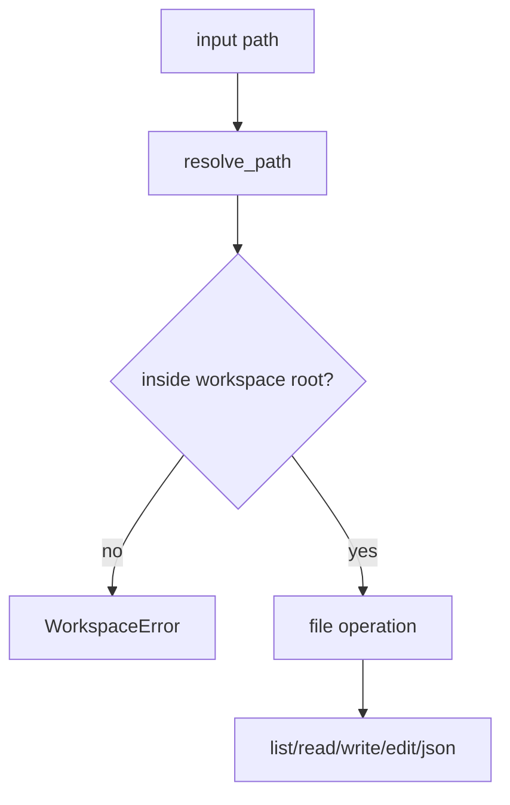

# Workspace

## Overview

`WorkspaceFS` is a filesystem facade that restricts all operations to one root
directory.

## Why It Exists

Agent tools often read/write files. Workspace isolation prevents accidental path escape and keeps runs reproducible.

## Architecture



## Key Classes

| Class | Description |
| ----- | ----------- |
| `agentkit.workspace.WorkspaceFS` | Root-scoped filesystem operations. |
| `agentkit.workspace.init_workspace_layout` | Creates workspace root and default subdirectories. |
| `agentkit.errors.WorkspaceError` | Raised for invalid paths and operation constraints. |

## Available Operations

| Method | Purpose |
| --- | --- |
| `resolve_path` | Normalize absolute or relative paths and enforce containment |
| `exists`, `is_file`, `is_dir` | Lightweight path checks |
| `mkdir`, `list_dir` | Directory management |
| `read_text`, `write_text`, `append_text`, `edit_text` | UTF-8 text operations |
| `read_json`, `write_json` | JSON convenience wrappers |

## How It Works

1. Paths are resolved to absolute form.
2. Relative paths are interpreted under `WorkspaceFS.root`.
3. Absolute paths are allowed only when they still resolve inside the workspace root.
4. Any path outside the root raises `WorkspaceError`.
5. File operations (`read_text`, `write_text`, `edit_text`, `read_json`, and so on) run only on resolved in-root paths.
6. `init_workspace_layout` creates the root directory plus default workspace subdirectories such as `logs/`.

## Editing Semantics

`WorkspaceFS.edit_text` is a direct substring replacement helper:

- `old` must be non-empty
- `count=None` replaces all occurrences
- `count=<n>` replaces up to `n` occurrences
- a missing `old` substring returns `0` instead of raising

The built-in `str_replace` tool adds stricter agent-facing behavior on top of this
primitive by requiring one exact match.

## Example

```python
from agentkit.workspace.fs import WorkspaceFS
from agentkit.workspace.layout import init_workspace_layout

root = init_workspace_layout("./workspace", extra_dirs=["notes"])
fs = WorkspaceFS(root)

fs.write_text("notes/todo.txt", "write docs")
text = fs.read_text("notes/todo.txt")
entries = fs.list_dir("notes")

print(text)
print(entries)
```

## Related Concepts

- [Tools System](./tools-system.md)
- [Run Log](./tracing.md)
